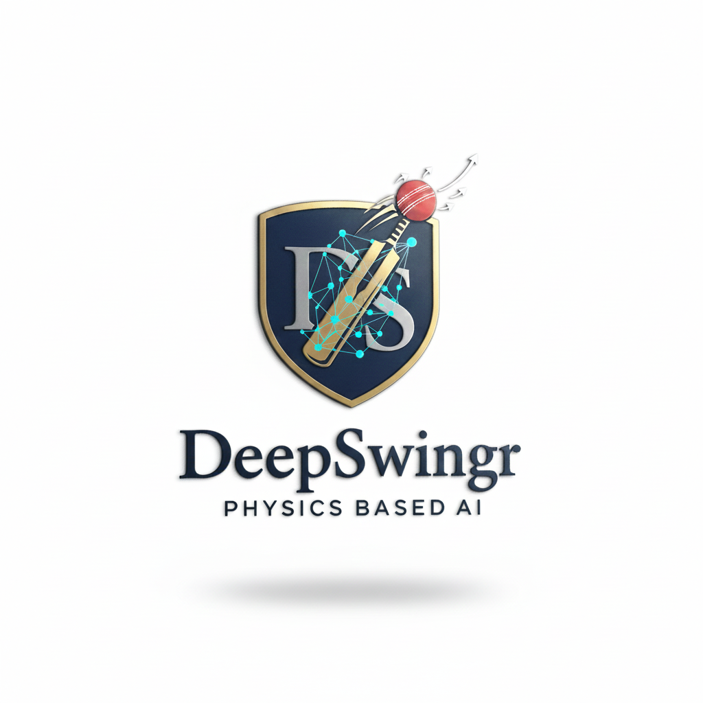
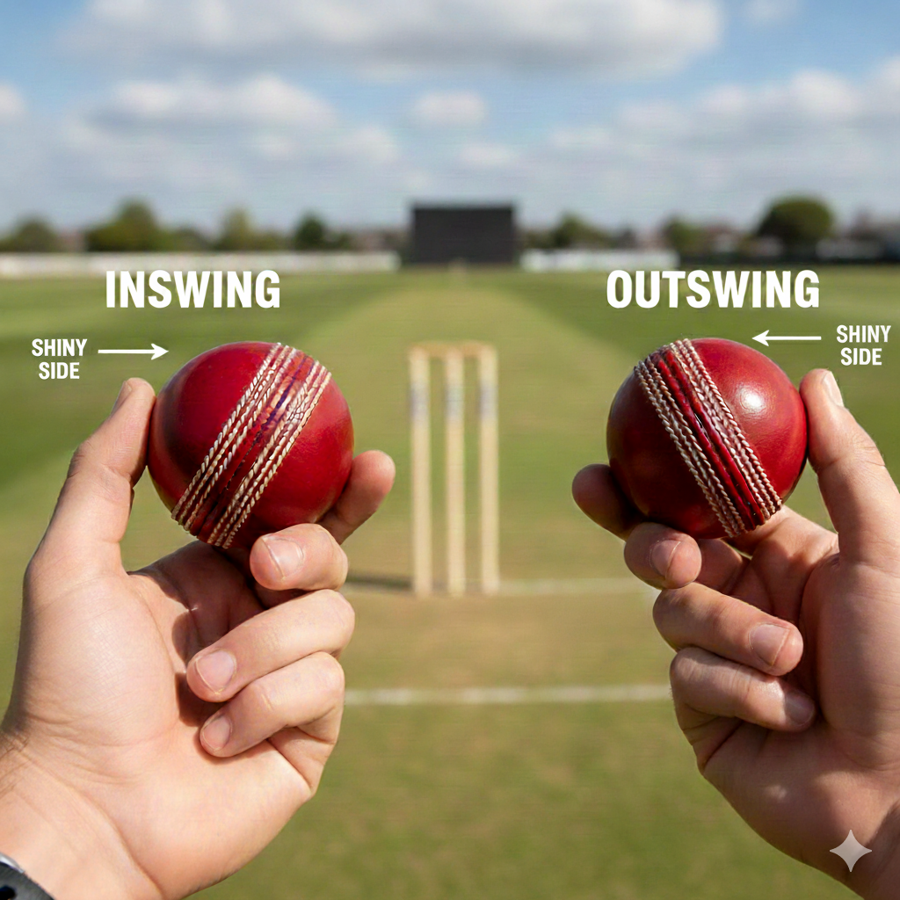
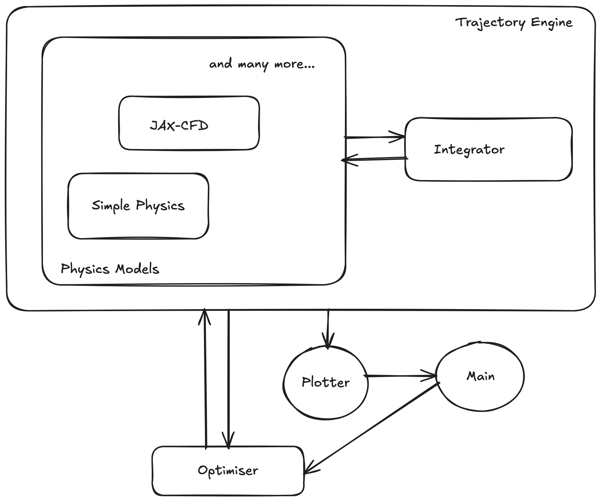

# DeepSwingr: A Differentiable Framework for Cricket Ball Swing Optimization

<p align="center">
  
</p>

A modular, differentiable simulation of cricket ball trajectory and swing using [Tesseract Core](https://github.com/pasteurlabs/tesseract-core) and [Tesseract-JAX](https://github.com/pasteurlabs/tesseract-jax).

## Introduction to Ball Swing

Cricket ball swing is a fascinating phenomenon driven by asymmetric fluid dynamics. By angling the seam of the ball relative to the airflow, a pressure differential is created between the two sides of the ball, resulting in a lateral force that causes the ball to "swing" in the air.

<p align="center">
  
</p>

There are two primary types of swing:

- **Conventional Swing**: As shown in the figure above, the ball typically swings in the direction the seam is pointing.
- **Reverse Swing**: This occurs when the ball moves _towards_ the shinier side (opposite to the seam direction). This usually happens at higher velocities or as the ball becomes older and one side becomes significantly rougher, causing the boundary layer to transition to turbulence differently.

Optimizing this swing involves finding the perfect balance between velocity, seam angle, and surface roughness. Traditional physics simulations can be computationally expensive; however, by leveraging differentiable fluid dynamics and ML proxies, we can rapidly explore the parameter space and use gradient-based optimization to find the "perfect delivery."

## System Architecture

<p align="center">
  
</p>

The project follows a highly modular architecture where different physical components are isolated into independent **Tesseracts**:

1.  **Physics Backend (`simplephysics` / `jaxphysics`)**: Computes forces (drag, lift, side) acting on the ball based on its state (velocity, spin, seam angle, roughness).
2.  **Integrator (`integrator`)**: Performs numerical integration of the equations of motion to predict the ball's trajectory.
3.  **Swing Logic (`swing`)**: A high-level tesseract that orchestrates the integrator and physics backend to determine the final deviation of the ball.
4.  **Optimiser (`optimiser`)**: Searches for optimal parameters (e.g., the best seam angle for maximum swing) by interacting with the `swing` tesseract.

## Adding a New Physics Backend

The DeepSwingr framework is designed to be easily extensible. You can plug in a new physics engine (e.g., a more advanced 3D CFD, a different ML proxy, or even a hardware-in-the-loop sensor) by following these steps:

### 1. Create the Tesseract

Create a new directory in `tesseracts/your_new_backend/` with a `tesseract_api.py`. It must implement the standard physics interface:

- **Input**: `notch_angle` (float), `reynolds_number` (float), `roughness` (float).
- **Output**: `force_vector` (Array of 3 floats: [drag, lift, side]).

### 2. Register the Backend

Add your new backend to the `PHYSICS_BACKENDS` registry in `helper/docker.py`:

```python
PHYSICS_BACKENDS = {
    # ... existing backends ...
    "your_new_backend": {
        "container": "your_new_backend",
        "image": "your_new_backend",
        "port": 8005,  # Unique port
        "url": "http://your_new_backend:8000" # Internal Docker URL
    }
}
```

### 3. Build and Run

1. Add your backend to `buildall.sh` (or just run `tesseract build tesseracts/your_new_backend`).
2. Run `python main.py`. Your new backend will automatically appear in the "Configure Physics Backend" menu.
3. The `integrator`, `swing`, and `optimiser` tesseracts will automatically route their requests to your new backend when selected.

## ML Proxies for Physics

This project utilizes **Machine Learning Proxies** to achieve high-performance, differentiable physics simulations.

Instead of running a computationally expensive Navier-Stokes solver (CFD) during every step of the trajectory integration, we use neural networks that act as surrogates for the underlying fluid dynamics. These models learn the complex mapping between physical parameters—such as surface roughness, seam angle, and Reynolds number—and the resulting aerodynamic forces (drag, lift, and side force).

### Proxy Training

The `trainall.sh` script automates the generation of these ML proxies. There are two models provided at the moment - `simplephysics` and `jaxphysics`, both of which are "toy" models with scaling factors. The `jaxphysics` model launches a **differentiable CFD solver** (powered by `jax-cfd`) to simulate flow fields around the ball. These scripts when executed, it:

1.  Runs a training loop where the neural network is optimized to match the forces computed by the CFD solver.
2.  Saves the learned weights as `.msgpack` files, which are then packaged into the Tesseracts for high-speed inference.

### Differentiable Forward Pass

A critical advantage of this approach is that the forward pass of our ML models is built using **Flax**, **Equinox**, and **Diffrax**. Because these libraries are designed for differentiable programming, the entire Tesseract pipeline remains **end-to-end differentiable**.

When you call `.jacobian()` or `.vjp()` on a Tesseract, the gradients are propagated directly through the neural network layers. This allows you to perform advanced tasks like:

- **Gradient-based optimization**: Finding the exact seam angle for maximum swing in just a few iterations.
- **Sensitivity analysis**: Understanding how small changes in surface roughness affect the ball's final position.

## Key Features

- **Modular Design**: Each component is a containerized Tesseract, allowing for easy swapping (e.g., replacing `simplephysics` with a neural-network-based `jaxphysics`).
- **End-to-End AD**: Full support for JVP/VJP across the entire pipeline, from high-level swing logic down to the ML-based physics proxies.
- **Apache 2.0 Licensed**: All core libraries and this template are released under the Apache License 2.0, ensuring freedom for both academic and commercial use.

## Get Started

### Prerequisites

- Python 3.10+
- Docker (Desktop recommended)
- `pip install -r requirements.txt`

### Steps to Reproduce

1.  **Clone and Setup**:

    ```bash
    git clone <your-repo-url>
    cd deepswingr
    python3 -m venv .venv
    source .venv/bin/activate
    pip install -r requirements.txt
    ```

2.  **Train Physics Models**:
    Run the training script to generate weights for the neural network physics engines:

    ```bash
    ./trainall.sh
    ```

3.  **Build Tesseracts**:
    Build the Docker images for all tesseracts:

    ```bash
    ./buildall.sh
    ```

4.  **Run the Simulator**:
    Launch the interactive CLI to visualize trajectories or optimize swing:
    ```bash
    python main.py
    ```

The following results were obtained using the `jaxphysics` model.

<p align="center">
  
  
</p>
<p align="center">
  <i>`jaxphysics`-Based Results Obtained for (a) Sample Trajectory and (b) Optimal Angle</i>
</p>

## Differentiable Pipeline

The `simplephysics` and `jaxphysics` tesseracts implement standard AD endpoints:

- `jacobian`: Full Jacobian matrix for sensitivity analysis.
- `jacobian_vector_product` (JVP): Forward-mode AD.
- `vector_jacobian_product` (VJP): Reverse-mode AD.

These can be called via the Tesseract SDK:

```python
from tesseract_core import Tesseract

physics = Tesseract.from_url("http://localhost:8001")
inputs = {"notch_angle": 30.0, "reynolds_number": 5e5, "roughness": 0.8}
jac = physics.jacobian(inputs, jac_inputs={"notch_angle"}, jac_outputs={"force_vector"})
print(f"Sensitivity to seam angle: {jac}")
```

## License

This project is licensed under the **Apache License 2.0**. See the [LICENSE](LICENSE) file for details.

## Contact

Please use the [issues tracker](https://github.com/gpavanb1/deepswingr/issues) for any questions.
